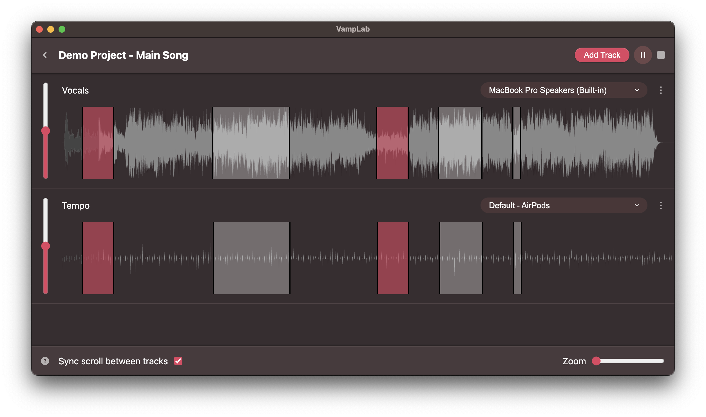

# VampLab

**Vamp:** In musical theatre, the few bars of music that may be repeated during dialogue or stage business. 

VampLab lets you define vamps that sync across tracks for your musical theatre plays. Tracks can be played out of different output devices, allowing for actors to hear their cues while the music plays. 

Vamps can be defined in edit mode by just dragging on a track, and deleted by alt-clicking on them. Both in edit and play mode, the looping of vamps can be toggled by clicking on them.

## Development

VampLab was designed and coded in under 65 hours by a single developer, [me](https://github.com/Pulmunyi)! My main goals were:

* Satisfy the request of La Salle's theater club, taking their use case into account when making UI/UX decisions.
* Refresh my React skills, after a 4-year hiatus.
* Learn the basics of Electron.

## Future additions

The following is a brief list of known issues to fix / improvements to make:

* Add keyboard support, including but not limited to: Space for Play/Pause, Ctrl-Z to undo, etc. This should also be integrated into the menu.
* Add support for drag-and-drop, both for project and audio files.
* Add a settings screen to manage certain options, including the ability to re-enable the project deletion confirm dialog.
* Add the ability to reorder songs in a project and tracks in a song.
* Add a "play project" feature, to play all songs in a project one after another.
* Improve behavior when tracks of different lengths are added to the same song.
* Refactor how projects are handled so multiple can be open at once.
* FIX: Projects can only be opened "natively" from the first screen.